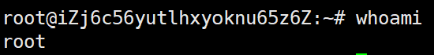
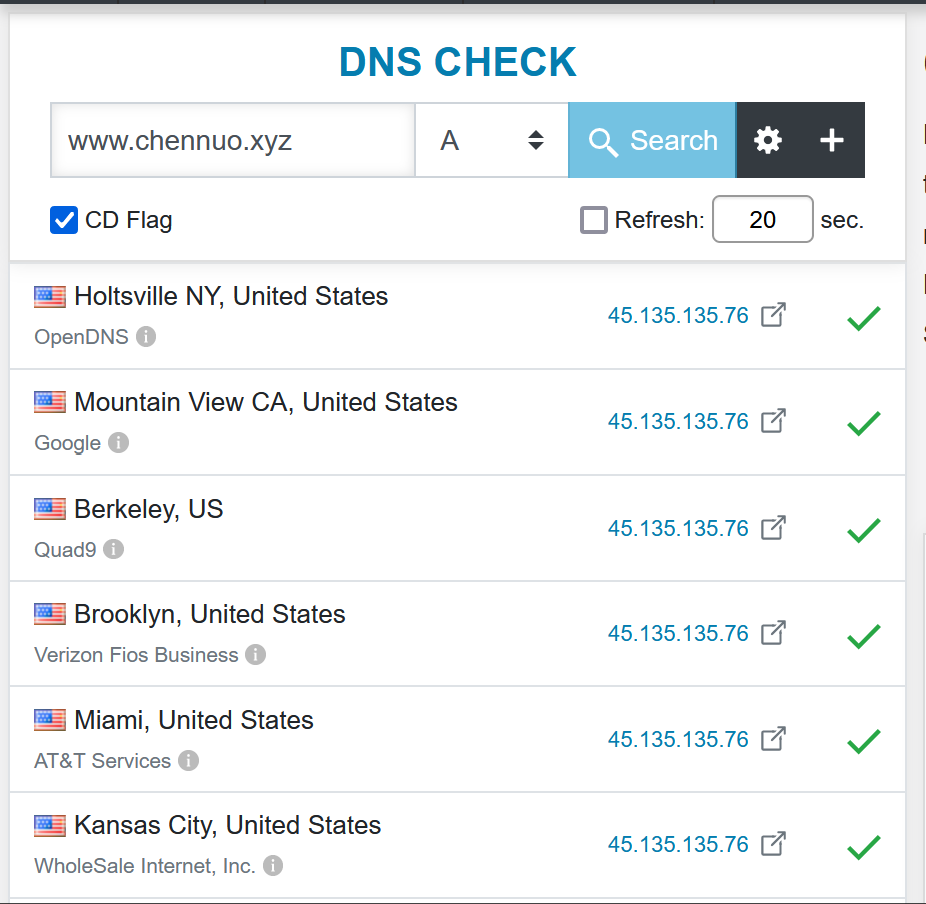
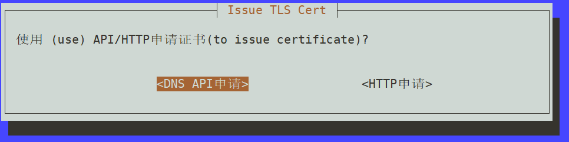
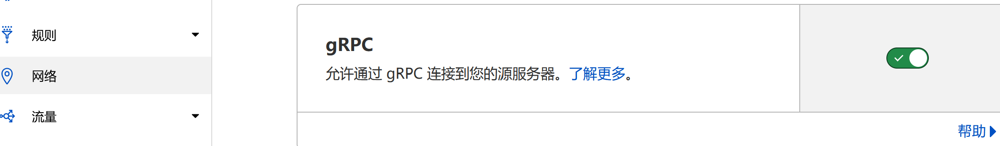
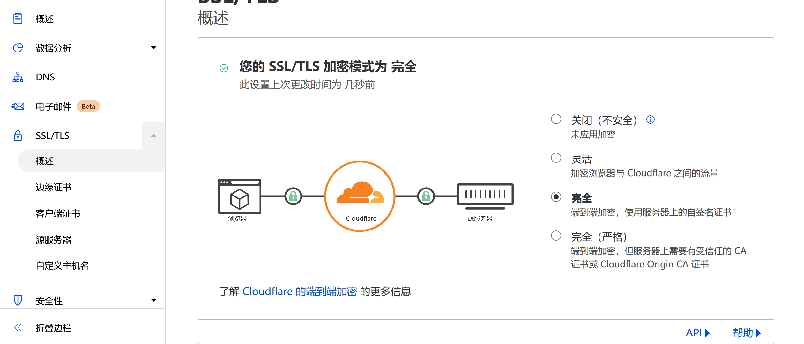

# 

[Telegram 频道](https://t.me/upx8_com) [English version](README_en.md)

厌倦了总是需要手动输入命令安装博客，网盘，RSS，邮箱，影音，代理了吗？VPSToolBox 提供了一整套全自动化的解决方案，解放双手，从今天开始！

> 一分钱一分货，觉得网络有问题的时候首先想想你在网络上投入了多少钱最合适。

## 给纯新手小白看的教程

[纯新手教程点这里！！！](README_bai.md)

## 一键命令 One click command

```bash
apt -o Acquire::AllowInsecureRepositories=true -o Acquire::AllowDowngradeToInsecureRepositories=true update && apt-get install sudo curl screen -y && curl -LO https://raw.githubusercontent.com/johnrosen1/vpstoolbox/master/vps.sh && sudo screen -U bash vps.sh
```

> 仅支援 **Debian/Ubuntu** 系统。

## 流程图


## 如果觉得好用，欢迎打钱帮助开发或者尝试以下服务，😃❤️🤣

[Namesilo](https://www.namesilo.com/?rid=685fb47qi)

[Hostyun](https://my.hostyun.com/page.aspx?c=referral&u=27710)

## 路由测试

路由测试用于自动生成Trojan/Vless链接，现已支持 `AS4134 AS4837 AS9808 AS4538 AS4809 AS9929 AS2914 AS2497 AS2516 AS4725 AS3491 AS9269 AS4635 AS4760 AS58453 AS4637 AS64050 AS6939 AS174 AS3356 AS3257 AS6461 AS701 AS7018 AS1239 AS1299 AS6453 AS6830 AS5511 AS6762 AS3320` 对应 `163 169 CMNET CERNET CN2 CU-VIP NTT IIJ KDDI SoftBank PCCW HKBN HKIX HKT CMI Telstra BGPNET HE Cogent LEVEL3 GTT Zayo Verizon ATT T-Mobile Arelion TATA Liberty Orange SPARKLE Deutsche`。

手动测试方法
```bash
curl --retry 5 -LO https://raw.githubusercontent.com/johnrosen1/vpstoolbox/master/install/route.sh
source route.sh
route_test
```

## Demo


## 前提条件及使用要点 Usage instruction

1. 请以 **root(sudo -i)** 运行(**可覆盖安装**)。



2. 请自行[购买](https://www.namesilo.com/?rid=685fb47qi)/[白嫖](https://www.freenom.com)/使用现有的**域名** 并 **[完成 DNS A 解析](https://dnschecker.org/)**，即将域名指向你的 VPS IP,(Namesilo 最慢需要 15+min 生效)。
3. 请在 服务器/VPS/其他各种 控制面板中 **完全关闭或禁用 VPS 防火墙(即开放所有 TCP + UDP 端口)。**
> _Trojan-gfw 以及 Shadowsocks-rust 皆支援 **Fullcone-nat** 但需服务器开启所有端口才能生效。
4. [HTTP 申请](https://github.com/acmesh-official/acme.sh/wiki/Blogs-and-tutorials) TLS 证书需 **域名 A 解析生效**，[API 申请](https://github.com/acmesh-official/acme.sh/wiki/dnsapi)则需要输入正确的信息。
5. 安装完成后，**BBR 已默认启用**，无需手动配置。
6. 如果需要通过Cloudflare CDN转发Vless(gRPC)流量,请在Cloudflare控制面板的**网络,SSL/TLS,防火墙**中按照下图进行设置。   

## 隐私声明

1. IP数据库使用[ipinfo.io](https://ipinfo.io/)，仅用于生成Vless以及Trojan链接。

## 免责声明 Disclaimer

1. 本项目不对使用 Vultr 提供的机器造成的任何可能问题负责(this project is not responsible for any possible problems caused by Vultr machines) !
2. 本项目部分非必须应用需要较高的系统资源和服务器配置(Rocket.chat以及邮箱等)，请量力而行 ！

## 支援的软件及应用 Supported applications

所有应用均支援全自动化安装与配置，**开箱即用** ！

> 打勾的为启用默认安装的,其余请手动选中以安装,分类标签仅供参考（删除线表示该应用已被淘汰或无实际价值）。

- 代理
  - [x] [Trojan-gfw 可自定义端口 不支持Cloudflare CDN转发 无最低配置要求](https://github.com/trojan-gfw/trojan)
  - [x] [Vless(grpc) 可自定义端口 低延迟 支持Cloudflare CDN转发 无最低配置要求](https://xtls.github.io/config/transports/grpc.html)
  - [ ] [Shadowsocks-rust 仅推荐搭配IPLC/IEPL使用 不支持Cloudflare CDN转发 无最低配置要求](https://github.com/shadowsocks/shadowsocks-rust)
- 系统
  - [x] [Acme.sh 支持HTTP或DNS API方式申请Let's encrypt证书](https://github.com/acmesh-official/acme.sh)
  - [x] [Tcp-BBR and tcp_fastopen 无要求](https://zh.wikipedia.org/wiki/TCP%E6%8B%A5%E5%A1%9E%E6%8E%A7%E5%88%B6#TCP_BBR)
  - [x] [Netdata 无最低配置要求](https://github.com/netdata/netdata)
- 前端
  - [x] [Nginx 无最低配置要求](https://github.com/nginx/nginx)
  - [x] [Alist](https://github.com/Xhofe/alist)
  - [ ] [Hexo Blog 无最低配置要求](https://github.com/hexojs/hexo)
  - [ ] [Typecho 无最低配置要求](https://typecho.org/)
- 下载
  - [ ] [Qbittorrent_enhanced_version 高硬盘需求](https://github.com/c0re100/qBittorrent-Enhanced-Edition)
  - [ ] [Aria2 高硬盘需求](https://github.com/aria2/aria2)
  - [ ] [AriaNG 仅作为前端使用 无最低配置要求](https://github.com/mayswind/AriaNg/)
- 网盘
  - [ ] [Nextcloud 高硬盘需求](https://github.com/nextcloud/server)
  - [ ] [Rclone 仅作为API使用 无最低配置要求](https://github.com/rclone/rclone)
  - [ ] [Filebrowser 高硬盘需求](https://github.com/filebrowser/filebrowser)
  - [ ] [Onedrive 高网络需求](https://johnrosen1.com/2021/02/14/onedrive/)
- RSS
  - [ ] [RSSHub 无最低配置要求](https://github.com/DIYgod/RSSHub)
  - [ ] [RSSHUB + Miniflux + Fever API实现多设备同步](https://johnrosen1.com/2022/01/26/rss/)
- 影音
  - [ ] [懒人党的福音--顶级全自动化影音系统全方位深入剖析](https://johnrosen1.com/2022/03/18/media/)
- 邮箱
  - [ ] [自建邮件伺服器指南基础篇](https://johnrosen1.com/2020/08/27/mail1/)
- 通讯
  - [ ] [RocketChat 高内存需求](https://github.com/RocketChat/Rocket.Chat)
- 测速
  - [ ] [Librespeed 无最低配置要求](https://github.com/librespeed/speedtest)
- 安全
  - [x] [Fail2ban 无最低配置要求](https://github.com/fail2ban/fail2ban)
- 其他
  - [ ] [Docker](https://www.docker.com/)
  - [ ] [Opentracker 高网络需求](https://erdgeist.org/arts/software/opentracker/)
  - [ ] [Qbittorrent_origin_version 高硬盘需求](https://github.com/qbittorrent/qBittorrent)

> 欢迎 PR 更多应用。

## 支援的 Linux 发行版

> 打勾的为测试过的,保证可用性,未打勾的表示理论上支援但未测试。

- [x] Debian11
- [x] Debian10
- [x] Debian9
- [ ] Debian8
- [x] Ubuntu 20.xx
- [x] Ubuntu 18.xx
- [ ] Ubuntu 16.xx
- [ ] Ubuntu 14.xx

## 支援的代理客户端

1. [v2rayNG 安卓](https://github.com/2dust/v2rayNG)
2. [Shadowrocket ios](https://apps.apple.com/us/app/shadowrocket/id932747118)
3. [Netch Windows](https://github.com/netchx/Netch)
4. [Qv2ray Windows/Linux/Macos](https://github.com/Qv2ray/Qv2ray)

## 可能的错误及原因

1. 证书签发失败
> 可能原因: （1）tcp 80/443即tcp http/https端口未开放 （2）域名A解析未完成 或 api信息输入错误
2. 重启后连不上了
> 可能原因: （1）VPS厂商面板问题(不常见)（2）重启时间长,请等待
3. 某个服务 404 / 502 了
> 可能原因: （1）安装清单里面没有勾选（2）某个服务掉线了(请及时反馈)
4. 安装中途卡住了  
> 可能原因: （1）网络缓慢或出错（2）CPU或硬盘 垃圾导致某个安装过程缓慢
5. 安装后连不上 
> 可能原因: （1）客户端配置错误（2）本地网络问题（3）某个服务掉线了(请及时反馈)

## 生成的CLI界面管理

关闭
```
mv /etc/profile.d/mymotd.sh /etc/
```
重新开启
```
mv /etc/mymotd.sh /etc/profile.d/mymotd.sh
```

## 证书续签日志

```
cat /root/.trojan/letcron.log
```

## 项目实现 Program Language

使用`bash shell`实现。

## 贡献 Contritbution

1. **Fork**本项目
2. **Clone**到你自己的机器
3. **Commit** 修改
4. **Push** 到你自己的 Fork
5. 提交**Pull request**
6. PR 要求请看[**pr 要求**](https://github.com/johnrosen1/vpstoolbox/tree/dev/install)

## Bug 反馈以及 Feature request

- [x] [Github Issue](https://github.com/johnrosen1/vpstoolbox/issues)
- [x] [TG 群组](https://t.me/vpstoolbox_chat)

注：

1. 其他的反馈方式我大概率看不见。
2. 除非你有能说服我的理由或者直接提 pr,否则**不接受代理软件支援请求**(比如 wireguard 之类的)。
3. 无论发生什么请**务必附上复现错误的步骤，截图，OS 发行版等信息**,否则我不可能能够提供任何帮助。

## Code Quality

1. 本项目实现了**模块化**

## Rclone 以及全自动上传脚本使用方法

**[Aria2+Rclone+Onedrive 实现全自动化下载](https://johnrosen1.com/2021/02/14/onedrive/)**

## Debug 相关

1. 本项目主要采用 systemd+docker-compose 启动服务。
2. 具体的懒得写了,`systemctl`查看运行状态,有问题记得反馈即可。

## License

```
MIT License

Copyright (c) 2019-2022 johnrosen1

Permission is hereby granted, free of charge, to any person obtaining a copy
of this software and associated documentation files (the "Software"), to deal
in the Software without restriction, including without limitation the rights
to use, copy, modify, merge, publish, distribute, sublicense, and/or sell
copies of the Software, and to permit persons to whom the Software is
furnished to do so, subject to the following conditions:

The above copyright notice and this permission notice shall be included in all
copies or substantial portions of the Software.

THE SOFTWARE IS PROVIDED "AS IS", WITHOUT WARRANTY OF ANY KIND, EXPRESS OR
IMPLIED, INCLUDING BUT NOT LIMITED TO THE WARRANTIES OF MERCHANTABILITY,
FITNESS FOR A PARTICULAR PURPOSE AND NONINFRINGEMENT. IN NO EVENT SHALL THE
AUTHORS OR COPYRIGHT HOLDERS BE LIABLE FOR ANY CLAIM, DAMAGES OR OTHER
LIABILITY, WHETHER IN AN ACTION OF CONTRACT, TORT OR OTHERWISE, ARISING FROM,
OUT OF OR IN CONNECTION WITH THE SOFTWARE OR THE USE OR OTHER DEALINGS IN THE
SOFTWARE.
```

## Stargazers over time

[](https://starchart.cc/johnrosen1/vpstoolbox)
